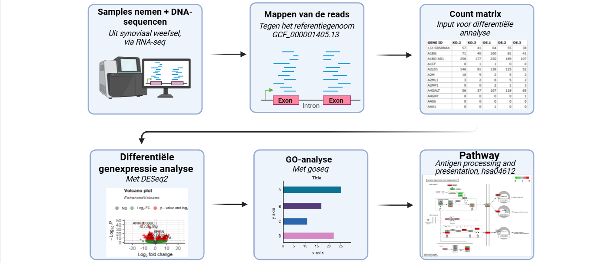
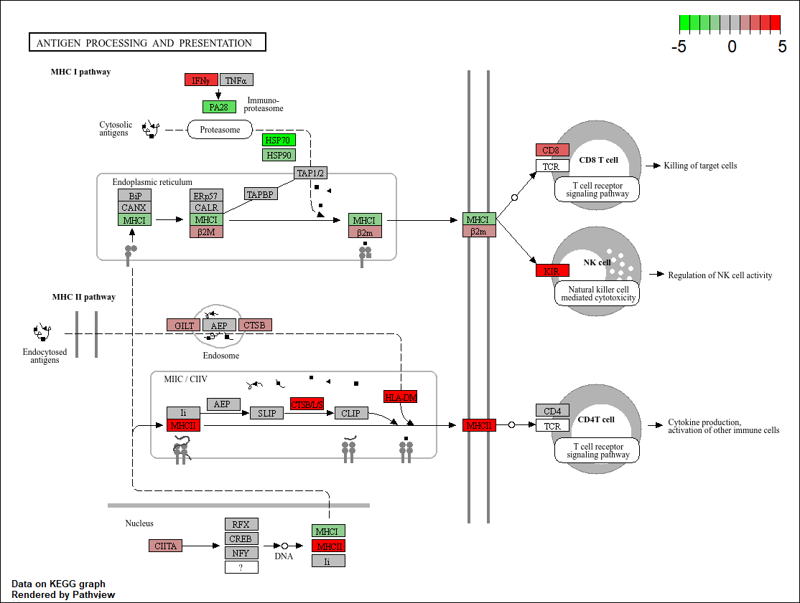

# Verhoogde expressie van de antigeenpresentatie route bij Reumatoïde Artritis bepaald via transcriptomics
___

**Inleiding**
---

Reumatoïde Artritis (RA) is een chronische auto-immuunziekte die 0,3-1% van de wereldbevolking krijgt en 2-3 keer vaker bij vrouwen voorkomt dan bij mannen ([Platzer et al., 2019](https://journals.plos.org/plosone/article?id=10.1371/journal.pone.0219698#abstract0)).  Hierbij valt het immuunsysteem het eigen gewrichtsslijmvlies aan, wat leidt tot aanhoudende ontstekingen.
Patiënten ervaren vaak pijn, stijfheid en zwelling in meerdere gewrichten, vaak aan beide kanten van het lichaam
([Majithia & Geraci, 2007](https://www.sciencedirect.com/science/article/abs/pii/S0002934307003610)).
Er is geen duidelijke oorzaak, geen uniform ziekteverloop en er bestaat momenteel geen genezende behandeling ([Platzer et al., 2019](https://journals.plos.org/plosone/article?id=10.1371/journal.pone.0219698#abstract0)). 
Wel zijn er behandelingen die het proces kunnen remmen ([Radu & Bungau, 2021](https://pmc.ncbi.nlm.nih.gov/articles/PMC8616326/)).
Omdat er nog zo veel onduidelijk is over RA is er behoefte aan een beter beeld van deze ziekte. Dit wordt in dit onderzoek gedaan door te kijken naar het verschil in genexpressie tussen de patiënten met RA en de controlegroep. Ook wordt er gekeken naar welke pathways een belangrijke rol spelen in het proces van RA.

In dit onderzoek wordt er dan ook antwoord gegeven op de vraag: Welke genen komen meer of minder tot expressie bij mensen met reumatoïde artritis, en welke metabole routes functioneren anders?

**Methode**
---	

_Figuur 1: flowschema van de volledige analyse._

#### Dataset 
In dit onderzoek is gebruik gemaakt van samples van 4 mensen met RA en 4 mensen zonder RA, genomen uit synoviaal weefsel (weefsel dat de binnenkant van gewrichten bekleed) (zie [metadata tabel](figuren/metadata%20tabel.md)). De reads zijn afkomstig uit een eerder onderzoek waarin ze gesequenced zijn via RNA-seq ([Platzer et al., 2019](https://journals.plos.org/plosone/article?id=10.1371/journal.pone.0219698#abstract0)). 

Met de genexpressie van deze patiënten is er een pathway gemaakt dat duidelijk het verschil aantoont tussen patiënten met RA en de controlegroep.

#### Analyse
De analyse is uitgevoerd met RStudio (versie 4.6.0).
Eerst zijn de reads geïndexeerd, deze stap is niet noodzakelijk maar scheelt wel tijd. Vervolgens zijn de reads gemapt met [Rsubread](https://academic.oup.com/nar/article/47/8/e47/5345150?luicode=10000011&lfid=231522type%3d1%26t%3d10%26q%3d%23bioinfo%23&u=https%3a%2f%2facademic.oup.com%2fnar%2farticle%2f47%2f8%2fe47%2f5345150&login=false) package (versie 2.26.0)(zie [indexeren+mappen](scripts/indexeren%20%2B%20mappen.R)).
Tijdens het mappen zijn de reads op de juiste positie in het referentiegenoom geplaatst. 
Na het mappen is er een count matrix gemaakt (zie [count matrix](scripts/count%20matrix.R)), hierin staat hoeveel reads er per gen zijn geteld voor elk monster. 
Vervolgens is er een metadata tabel gemaakt waarin staat wat de condities zijn per monster (zie [metadata](scripts/metadata.R)).
Daarna is er een differentiële genexpressie analyse uitgevoerd met [DESeq2](https://cdimage.debian.org/mirror/bioconductor.org/packages/3.3/bioc/vignettes/DESeq2/inst/doc/DESeq2.pdf) (versie 1.52.0) om te bepalen of de genexpressie statistisch significant verschilt tussen de controlegroep en de groep met RA (zie [statistiek](scripts/statistiek.R)). 
Hierna is een GO-analyse uitgevoerd met de [goseq]( https://ftp.acc.umu.se/mirror/bioconductor.org/packages/3.8/bioc/vignettes/goseq/inst/doc/goseq.pdf) package (versie 1.64.0)(zie [GO-analyse](scripts/GO-analyse.R)), [GCF_000001405.13]( https://www.ncbi.nlm.nih.gov/datasets/genome/GCF_000001405.13/) is gebruikt als referentiegenoom. 
Hiermee kan er gezien worden welke biologische processen en functies het meest afwijken in patiënten met RA. Deze informatie helpt bij het kiezen van relevante KEGG-pathways.
Tot slot wordt de gekozen pathway (Antigen processing and presentation, hsa04612) gevisualiseerd (zie [pathway](scripts/pathway.R)), dit is gedaan met de package [pathview](https://academic.oup.com/bioinformatics/article/29/14/1830/232698?login=false&guestAccessKey=) (versie 1.52.0).

[Volledig script](scripts/volledig%20script.R)

**Resultaten**
---

In [deze tabel](figuren/genexpressie%20tabel.csv) is te zien dat IGHV3-53 de hoogste log2FoldChange heeft, MXRA7P1 de laagste log2FoldChange en ANKRD30BL de laagste p-waarde heeft.

Uit de differentiele genexpressie analyse is een [vulcano plot](figuren/vulcano%20plot.png) gemaakt ([EnhancedVolcano](https://academic.oup.com/bioinformatics/article/41/7/btaf367/8171986?login=false&guestAccessKey=))(versie 1.30.0). Deze toont aan dat het grootste deel van de genen geen significante verandering in expressie laat zien (p-waarde > 0,05), een klein deel hiervan had ook nog een te lage fold change. Een grote groep had wel een p-waarde die klein genoeg is, 2085 van deze genen hadden een log2 fold change van groter dan 1, 2487 genen hadden een log2 fold change van kleiner dan -1. 
Opvallend is het gen ANKRD30BL, dit gen heeft zowel een hele kleine p-waarde als een grote log2 fold change. 

In de [staafdiagram](figuren/GO-analyse.png) uit de GO-analyse is te zien dat het immunoglobulinecomplex (antlichamen) een relatief groot aantal genen bevat die verschillen in expressie tussen de groep met RA en de controlegroep. Daarom is de pathway `Antigen processing and presentation’ (hsa04612) bekeken. In figuur 2 is te zien dat de genen IFNy, CD8 en KIR in de MHC I route meer tot expressie komen bij patiënten met RA, deze genen zorgen voor verhoogde responsen van CD8 T-cellen en NK-cellen. Deze cellen spelen een belangrijke rol in het herkennen en vernietigen van cellen tijdens een ontstekingsreactie. In de MHC II route komen de genen HLA-DM, CTSB/L/S en MHCII meer tot expressie bij patiënten met RA, deze genen zijn betrokken bij het presenteren van endocytose-antigenen aan CD4-T-cellen. De CD4-T-cellen produceren cytokines en activeren andere immuuncellen. Een verhoogde expressie hiervan zorgt voor een versterkte ontstekingsreactie. 

**Conclusie**
---
Uit dit onderzoek blijkt dat de genen die betrokken zijn bij antigeenprocessing en -presentatie duidelijk anders tot expressie komen bij patiënten met RA dan bij gezonde personen. 

De vulcano plot liet zien dat er meerdere genen zijn die veranderen in expressie. Uit de GO-analyse is gebleken dat deze genen zich vooral bevinden in het immunoglobulinecomplex. Om deze reden is er gekeken naar de antigeenprocessing en presentatie pathway.

Bij zowel MHC I als MHC II laten gerelateerde genen een verhoogde expressie zien bij patiënten met RA. Dit past bij het beeld van een overactief immuunsysteem bij RA. Deze kennis draagt bij aan een beter inzicht in de processen die betrokken zijn bij RA en zo bijdraagt aan mogelijke verdere ontwikkeling in toekomstige behandelingen. 

Ook in toekomstig onderzoek kan transcriptomics een belangrijke rol spelen in het krijgen van een beter inzicht in deze ziekte.

Deze bevindingen bevestigen dat antigeenprocessing en -presentatie een belangrijke rol spelen in de ontregeling van het immuunsysteem bij RA.
